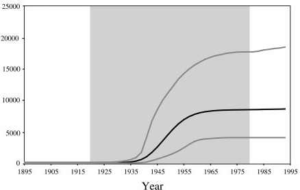
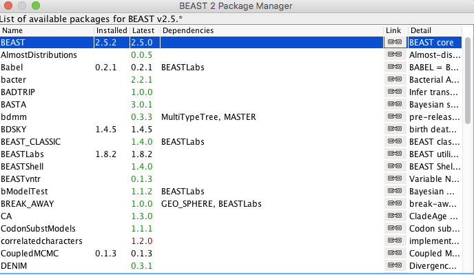
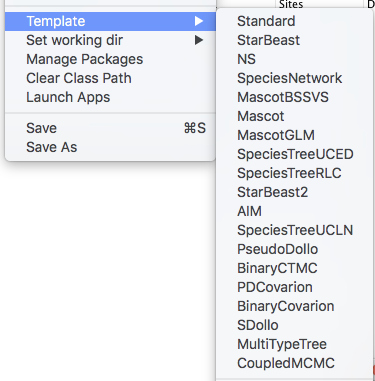
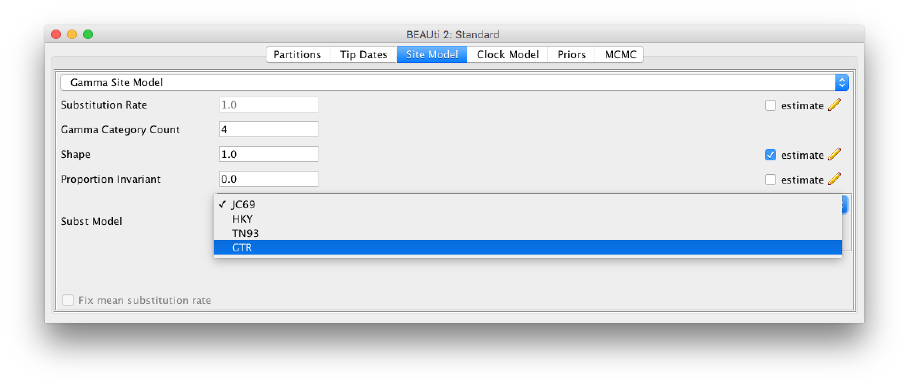
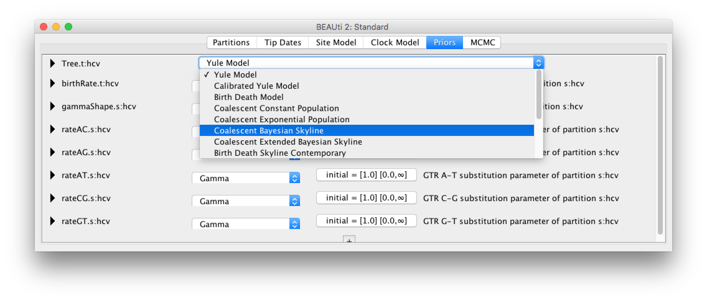
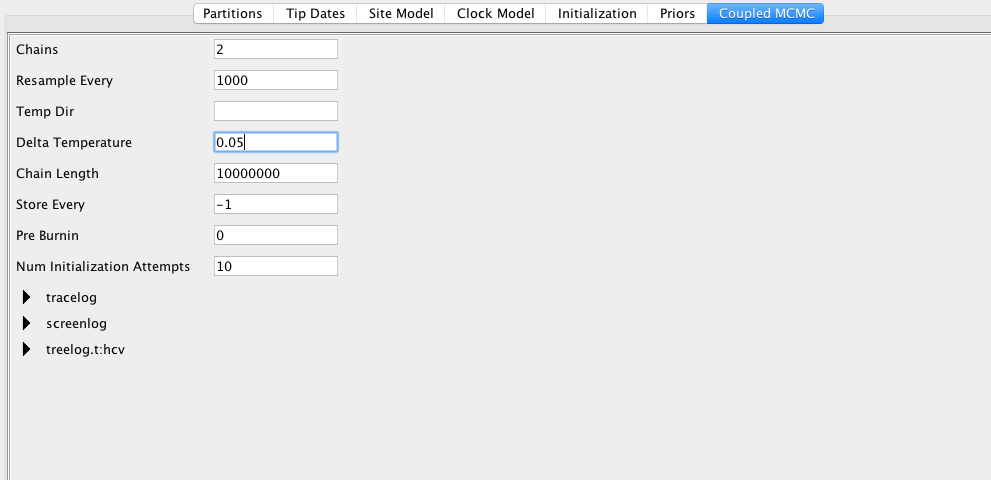
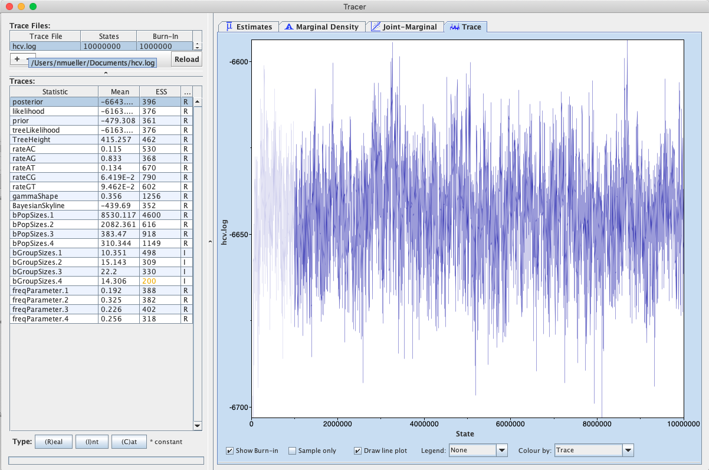
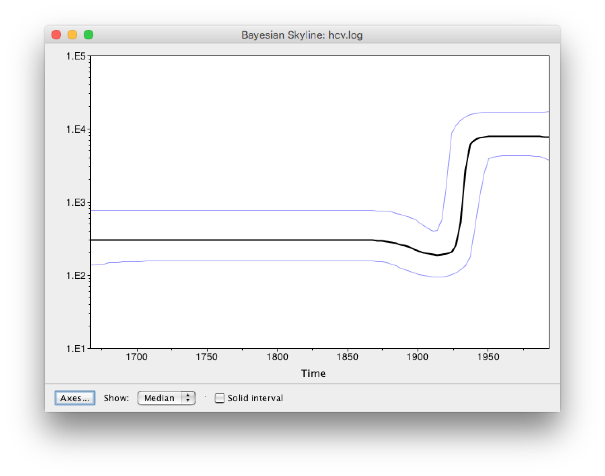
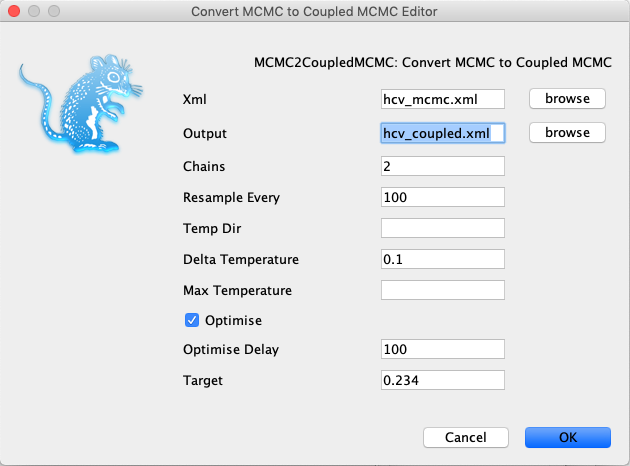

# Background

Parallel tempering is a Bayesian approach that uses heated chains in order to traverse unfavourable intermediate states more easily and in order to parallelise analyses.
Parallel tempering works by having one cold chain which works exactly the same as a standard MCMC chain and one or more heated chains.
The chains are heated in temperature increments defined in this implementations as *deltaTemperature*.
These heated chains have increase acceptance probabilities, making it more easily for them to explore parts of the state space that are less likely.
In turn however, these heated chains to not explore the posterior probability space such that the frequency at which they visit a state is proportional to their probability.
The can however be used to propose new states.
In order to do so, parallel tempering proposes to exchange the states of two random chains after each chain is run for some amount of iterations in what amounts to a MCMC move.
After how many iterations the states of two random chains are proposed to be swapped is in this implementation called *resampleEvery*.
The webpage [https://darrenjw.wordpress.com/2013/09/29/parallel-tempering-and-metropolis-coupled-mcmc/](https://darrenjw.wordpress.com/2013/09/29/parallel-tempering-and-metropolis-coupled-mcmc/), gives a good introduction into how parallel tempering.

Typically, using such an approach requires to find optimal temperatures for heated chains that allow using the additional computational resources efficiently.
The parallel tempering approach implemented in CoupledMCMC circumvents this by automatically tuning this temperature difference during a run to achieve an acceptance probability of swaps of 0.234.
This means that the only additional parameter that has to be specified by the user is the number of chains used, which is typically determined by the number of CPU's available.


----

# Programs used in this Exercise

### BEAST2 - Bayesian Evolutionary Analysis Sampling Trees 2

BEAST2 ([http://www.beast2.org](http://www.beast2.org)) is a free software package for Bayesian evolutionary analysis of molecular sequences using MCMC and strictly oriented toward inference using rooted, time-measured phylogenetic trees. This tutorial is written for BEAST v{{ page.beastversion }} .


### BEAUti2 - Bayesian Evolutionary Analysis Utility

BEAUti2 is a graphical user interface tool for generating BEAST2 XML configuration files.

Both BEAST2 and BEAUti2 are Java programs, which means that the exact same code runs on all platforms. For us it simply means that the interface will be the same on all platforms. The screenshots used in this tutorial are taken on a Mac OS X computer; however, both programs will have the same layout and functionality on both Windows and Linux. BEAUti2 is provided as a part of the BEAST2 package so you do not need to install it separately.

### TreeAnnotator

TreeAnnotator is used to summarise the posterior sample of trees to produce a maximum clade credibility tree. It can also be used to summarise and visualise the posterior estimates of other tree parameters (e.g. node height).

TreeAnnotator is provided as a part of the BEAST2 package so you do not need to install it separately.


----

# Practical: Setting up an analysis with CoupledMCMC

In this tutorial, we will describe the two different ways to setup a BEAST2 analysis to run with CoupledMCMC
To do so, we will setup a Bayesian Skyline plot analysis by following analogue to the tutorial on [skyline plots](https://taming-the-beast.org/tutorials/Skyline-plots/).

Setting up an analysis in BEAUTi is currently only possible for analyses that only use the standard template, i.e. such for which setting up an analysis does not require to load a template.

All other analyses can use a conversion tool to convert an MCMC xml into a parallel tempering xml.


## The Data

The dataset consists of an alignment of 63 Hepatitis C sequences sampled in 1993 in Egypt . This dataset has been used previously to test the performance of skyline methods .

With an estimated 15-25%, Egypt has the highest Hepatits C prevalence in the world. In the mid 20^(th) century, the prevalence of Hepatitis C increased drastically (see [Figure 1](#fig:prevalence) for estimates). We will try to infer this increase from sequence data.

<figure>
	<a id="fig:prevalence"></a>
	
	<figcaption>Figure 1: The estimated number of Hepatitis C cases in Egypt .</figcaption>
</figure>
<br>


### Download CoupledMCMC
First, we have to download the CoupledMCMC package by using the BEAUTi package manager. Go to `File >> Manage Packages` and download the package and CoupledMCMC StarBeast2.

<figure>
	<a id="fig:example1"></a>
	
	<figcaption>Figure 1: Download the CoupledMCMC package</figcaption>
</figure>

## For analyses that don't require to load a template

If for your analysis, no loading of a template is required, we can setup the analysis in BEAUTi:

### Loading the template

Next, we have to load the BEAUTi template from `File`, select `Template >> CoupledMCMC`.

<figure>
	<a id="fig:example1"></a>
	
	<figcaption>Figure 2: Load the CoupledMCMC template to setup an analysis.</figcaption>
</figure>

This template is exactly the same as the standard BEAUTi template, but uses parallel tempering instead of regular MCMC.


### Setting up the analysis with Bayesian Coalescent Skyline (similar to [skyline plots](https://taming-the-beast.org/tutorials/Skyline-plots/))

To import the aligned sequences into BEAUti, use `File > Import Alignment` to select the `*.nexus` file.

BEAUti will recognize the sequences from the `*.nexus` file as nucleotide data. It will do so for sequence files with the character set of **A | C | G | T | N**, where **N** indicates an unknown nucleotide. As soon as other non-gap characters are included (e.g. using **R** or **Y** to indicate purines and pyramidines) BEAUti will not recognize the data as nucleotides anymore, unless the type of data is specified in the `*.nexus` file.

After we have loaded the sequences into BEAUti, we have to specify the evolutionary model. We will be using the very general GTR model ([Figure 3](#fig:model)), which estimates transition probabilities between individual nucleotides separately, meaning that transition probabilities between e.g. **A** and **T** will be inferred separately to the ones between **A** and **C**. Additionally, we should allow for rate heterogeneity among sites. We can do this by changing the Gamma Category Count to 4 (normally between 4 and 6).

<figure>
	<a id="fig:model"></a>
	
	<figcaption>Figure 3: Set GTR as a site model. Also use a Gamma Category Count of 4.</figcaption>
</figure>
<br>

As we use sequences that were sampled at the same point in time, we need to fix the clock rate (for more information on this please refer to the tutorial on molecular clocks). We will use an estimate inferred in  to fix the clock rate. In this case all the samples were contemporaneous (at the same time) and the clock rate works as a mapping of the estimated tree branch lengths into calendar time.

We will keep the strict clock model and will set `Clock.rate` to 0.00079.

Next, we need to go the the `Priors` tab and set the Bayesian Coalescent Skyline as a tree prior ([Figure 4](#fig:coalescent)).

<figure>
	<a id="fig:coalescent"></a>
	
	<figcaption>Figure 4: Choose the Coalescent Bayesian Skyline as a population prior.</figcaption>
</figure>
<br>

The Bayesian Coalescent Skyline works by dividing the time between the present and the root of the tree into intervals, thus the number of these intervals has to be defined. Each interval will have a different effective population size.
The Bayesian Coalescent Skyline will estimate the number of coalescent events within each interval (which is captured in the Group Size parameter) as well as the effective population size for that interval. The number of intervals is equal to the dimension specified. If we have   intervals, the effective population size is allowed to change  times. To specify the number of dimensions, we need to first go to the initialization panel. This is by default not visible `View > Show Initialization Panel`.

For this analysis we will set the number of dimensions to 4 (the default value is 5). Keep in mind that one has to change the dimension of `bPopSizes` as well as `bGroupSizes`. The dimension of both parameters has to be the same ([Figure 5](#fig:dimensions)).

<figure>
	<a id="fig:dimensions"></a>
	
	<figcaption>Figure 5: Set the dimension of the two parameters, bPopSizes and bGroupSizes, to 4.</figcaption>
</figure>
<br>

Choosing the dimension for the Bayesian Coalescent Skyline can be rather arbitrary. If the dimension is chosen too low, not all population changes are captured, if it is chosen too large, there might be too little information in an interval to support an estimate of a population size. There are implementations in BEAST of the coalescent skyline that either sample dimensions (Extended Bayesian Skyline ) or do not require dimensions to be specified (Skyride ).

We can leave the rest of the priors as they are and go to the `Parallel tempering` panel.
In contrast to regular MCMC, we have to define a few more things.
First, we have to define the number of chains.
This number should be equal to the number of threads you can run, resp. the number of CPU cores.
The `Resample Every`, defines after how many iterations, two chains should be proposed to exchange states.
If this is too low, the chains will communicate a lot and the exchanging of states itself can consume more time then the actual MCMC.
If it's too high, the states of chains are exchanged and the ESS per time isn't as high as it could be.
We here exchange states between the 2 chains every 1000 iterations, which will allow for at most 10 000 swaps of states during the whole analysis.

The next parameter we have to set is the `Delta Temperature`.
Hotter chains are more easily able to cross unlikely intermediate states and can therefore help chains to move out of local optimas.
`Delta Temperature` here is only the initial value of the temperature difference between the two chains and will be tuned lated on automatically.
`Target` defines the target acceptance probability.
The temperature difference will be adapted during the analysis to match this acceptance probability over the course of the analysis.

Overall, it should be chosen such that the acceptance probability of an exchange of states between chains is between 0.25 and 0.6 .

<figure>
	<a id="fig:dimensions"></a>
	
	<figcaption>Figure 6: Setting up the parameters fo the coupled MCMC.</figcaption>
</figure>
<br>

### Running the xml


Next, we can run the xml.
The output to the screen of a Coupled MCMC run looks slightly different then the one of a standard MCMC run.
The column called *sample* describes at which iteration of the coupled MCMC we are.
The column *swapsColdChain* denotes how many times the one cold chain (the chain that runs just like a regular MCMC chain) has been swapped with another chain.
The *swapProbability* denotes how likely it is that a swapping between two chains is accepted.
By default, a value of 0.234 is targeted.
The column *deltaTemperature* denotes the current temperature difference between chains.

```
sample	swapsColdCain	swapProbability	deltaTemperature
	0	0	0.0	0.1
	1000	0	0.0	0.1 --
	2000	0	0.0	0.1 --
	3000	0	0.0	0.1 --
	4000	0	0.0	0.1 --
	5000	1	0.2	0.1 --
	6000	1	0.16666666666666666	0.1 --
	7000	1	0.2857142857142857	0.1 --
	8000	1	0.25	0.1 --
	9000	1	0.2222222222222222	0.1 --
	10000	1	0.2	0.1 --
	11000	1	0.18181818181818182	0.1 2m29s/Msamples
	12000	1	0.16666666666666666	0.1 2m35s/Msamples
	13000	1	0.15384615384615385	0.1 2m39s/Msamples
	14000	1	0.14285714285714285	0.1 2m37s/Msamples
	15000	1	0.13333333333333333	0.1 2m41s/Msamples
	16000	1	0.125	0.1 2m42s/Msamples
	17000	1	0.11764705882352941	0.1 2m46s/Msamples
```


### Exploring the results of Bayesian Coalescent Skyline analysis

For the reconstruction of the population dynamics, we need two files: the `hcv.log` file and the `hcv.trees` file.
These outputs can be handled exactly the same as the ones of a regular MCMC analysis.
The log files contain the information about the group size and the population size.
The group size specifies how many intervals are combined to have the same effective population size.

<figure>
	<a id="fig:dimensions"></a>
	
	<figcaption>Figure 7: opening the log file in tracer.</figcaption>
</figure>
<br>


After the runs have finished, load the finished `hcv.log` file into Tracer. Alternatively you can use the `hcv.log` files and the `hcv.trees` files you downloaded with the data. To run the analysis, open the finished `hcv.log` file into Tracer, then go to `Analysis > Bayesian Skyline Reconstruction`. From there open the finished `hcv.trees` file. To get the correct years in the analysis we should specify the `Age of the youngest tip`. In our case it is 1993, the year where all the samples were taken. If the samples were taken through time, the age of the youngest tip is the time when the most recent sample was taken. If you now press the `Ok` button, the reconstruction of the past population dynamics will be performed ([Figure 8](#fig:trees)).

<figure>
	<a id="fig:trees"></a>
	
	<figcaption>Figure 8: Reconstructing the Bayesian Skyline plot in Tracer.</figcaption>
</figure>
<br>

The output will have the years on the x-axis and the effective population size on the y-axis. By default, the y-axis is on a log-scale. If everything worked as it is supposed to work you will see a sharp increase in the effective population size in the mid 20^(th) century, similar to what is seen on [Figure 9](#fig:skyline).

<figure>
	<a id="fig:skyline"></a>
	
	<figcaption>Figure 9: Bayesian Coalescent Skyline analysis output. The black line is the median estimate of the estimated effective population size (can be changed to the mean estimate). The two blue lines are the upper an the lower estimates of 95% interval. The x-axis is the time in years.</figcaption>
</figure>
<br>

There are two ways to save the analysis, it can either be saved as a `*.pdf` or as a tab delimited file. To save it as a tab delimited file, you can go to `File > Export Data`. The exported file will have five rows, the time, the mean, median lower 95% interval and the upper 95% interval of the estimates, which you can use to plot the data with other software (R, Matlab, etc).

### Assessing convergence

Since parallel tempering runs multiple chains, it is possible for all these chains to be stuck in local optima.
Parallel tempering will then cycle through these chains that are all stuck in local optima.
This can create vert high ESS values of analyses that did not converge.
It is therefore highly advisable to run several replicates (e.g. 3) of the same analysis to see if they all give the same result.
Additionally, ESS might not be the best measure of converge of a parallel tempering analysis and something like the potential scale reduction factor might be more suited to assess convergence.

(Running replicates is not only advisable for parallel tempering analysis, but for MCMC as well).


## Setting up the same analysis for packages that require loading their own template

In order to setup a parallel tempering analysis for packages that require loading their own packages, we can use a BEAUti app.
To do so, open BEAUti and go to `File`, select `Launch Apps`.
There, click on MCMC to Coupled MCMC converter and click `Launch`.

First, load the MCMC xml and define an output file for the parallel tempering xml.
Then, the analysis can be setup, such as for example the number of chains can be defined.
When everything is setup, just press launch and the parallel tempering xml will be created.
This xml can then be run using parallel tempering.

<figure>
	<a id="fig:skyline"></a>
	
	<figcaption>Figure 10: Launching the MCMC to Coupled MCMC app.</figcaption>
</figure>
<br>

----

# Useful Links

- Blog post explaining coupled MCMC [https://darrenjw.wordpress.com/2013/09/29/parallel-tempering-and-metropolis-coupled-mcmc/](https://darrenjw.wordpress.com/2013/09/29/parallel-tempering-and-metropolis-coupled-mcmc/)
- Coupled MCMC source code: [https://github.com/nicfel/CoupledMCMC](https://github.com/nicfel/CoupledMCMC)
- [Bayesian Evolutionary Analysis with BEAST 2](http://www.beast2.org/book.html) 
- BEAST 2 website and documentation: [http://www.beast2.org/](http://www.beast2.org/)
- Join the BEAST user discussion: [http://groups.google.com/group/beast-users](http://groups.google.com/group/beast-users)

----

# Relevant References


